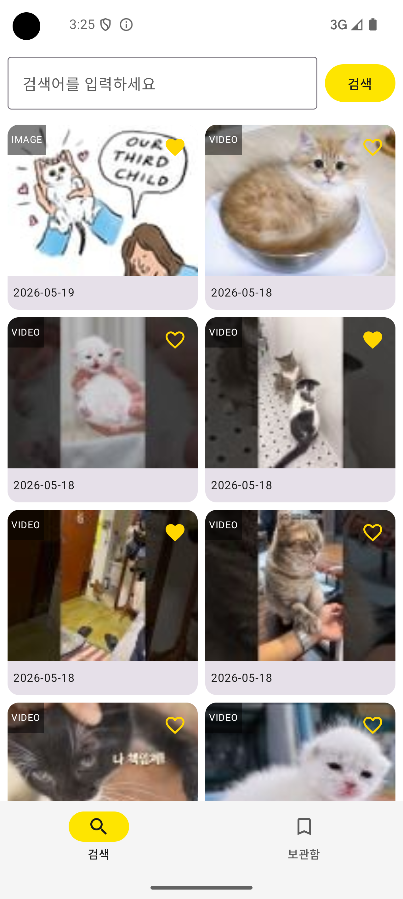
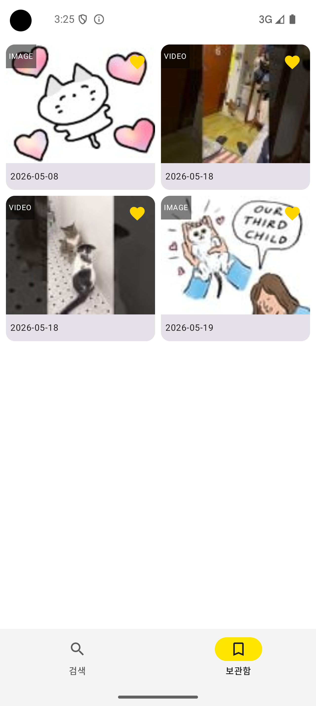
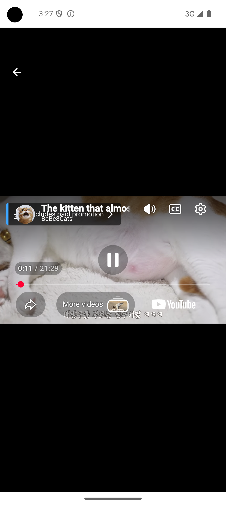

# Android 과제 연습용

카카오 검색 API를 이용해 이미지/동영상을 검색하고 보관함에 저장하는 Android 앱입니다.

---

## 주요 기능

### 검색 화면
- 키워드 입력 시 이미지/동영상 검색 API를 병렬 호출
- 두 결과를 `datetime` 기준 최신순으로 정렬하여 하나의 리스트로 표시
- 무한스크롤로 추가 결과 로드
- 아이템 선택 시 보관함 저장/제거 (하트 아이콘으로 표시)
- 아이템 클릭 시 상세화면으로 이동

### 보관함 화면
- 보관한 아이템을 저장 순서대로 표시
- 아이템 선택 시 보관함 제거 (하트 아이콘으로 표시)
- 아이템 클릭 시 상세화면으로 이동

### 상세화면
- 이미지: 전체화면으로 표시
- 동영상: 유튜브 플레이어로 재생
- 검색/보관함 화면 양쪽에서 접근 가능

---

## 기술 스택

| 분류 | 기술 |
|------|------|
| 언어 | Kotlin |
| UI | Jetpack Compose |
| 아키텍처 | Clean Architecture + MVVM |
| DI | Hilt |
| 비동기 | Coroutines + StateFlow |
| 네트워크 | Retrofit2 + OkHttp3 |
| 직렬화 | Gson |
| 이미지 로딩 | Glide |
| 동영상 재생 | android-youtube-player 13.0.0 |
| 로컬 저장 | SharedPreferences |
| 내비게이션 | Compose Navigation |
| 테스트 | JUnit4 + MockK + kotlinx-coroutines-test |
| 커버리지 | Jacoco |

---

## 아키텍처

Clean Architecture 기반의 3개 레이어로 구성되며, 의존성 방향은 `Presentation → Domain ← Data`입니다.

```
presentation/       UI, ViewModel (Android 프레임워크 의존 허용)
domain/             UseCase, Repository 인터페이스, 모델 (순수 Kotlin)
data/               Repository 구현체, Remote/Local DataSource
di/                 Hilt 모듈
```

### 주요 설계 결정

**병렬 API 호출**
이미지/동영상 검색을 `async { }`로 동시 요청 후 각각 `.await()`로 결과를 합산하고 `datetime` 기준 내림차순 정렬합니다.

**보관함 상태 동기화**
`SearchViewModel`과 `BookmarkViewModel`이 동일한 `BookmarkRepository` 인스턴스를 Hilt로 주입받아 상태를 공유합니다.

**검색 결과 상태 관리**
`LinkedHashMap<thumbnailUrl, MediaItem>`으로 관리하여 보관함 토글 시 O(1) 접근, 무한스크롤 시 삽입 순서 유지를 동시에 달성합니다.

**로컬 저장**
`MediaItem`을 Gson으로 JSON 직렬화하여 SharedPreferences에 저장합니다. DB 관련 라이브러리는 사용하지 않습니다.

---

## 프로젝트 구조

```
app/src/main/java/com/example/kakaobank/
├── presentation/
│   ├── MainActivity.kt
│   ├── UiState.kt
│   ├── search/
│   │   ├── SearchScreen.kt
│   │   └── SearchViewModel.kt
│   ├── bookmark/
│   │   ├── BookmarkScreen.kt
│   │   └── BookmarkViewModel.kt
│   ├── detail/
│   │   └── DetailScreen.kt
│   ├── component/
│   │   └── MediaGrid.kt
│   ├── navigation/
│   │   ├── NavGraph.kt
│   │   └── Screen.kt
│   └── ui/theme/
│       ├── Color.kt
│       └── Theme.kt
├── domain/
│   ├── model/
│   │   └── MediaItem.kt
│   ├── repository/
│   │   ├── ISearchRepository.kt
│   │   └── IBookmarkRepository.kt
│   └── usecase/
│       ├── SearchMediaUseCase.kt
│       ├── ToggleBookmarkUseCase.kt
│       └── GetBookmarksUseCase.kt
├── data/
│   ├── remote/
│   │   ├── KakaoSearchApi.kt
│   │   └── dto/
│   ├── local/
│   │   └── BookmarkLocalDataSource.kt
│   └── repository/
│       ├── SearchRepositoryImpl.kt
│       └── BookmarkRepositoryImpl.kt
└── di/
    ├── NetworkModule.kt
    └── RepositoryModule.kt
```

---

## 실행 방법

### 1. API 키 설정

프로젝트 루트의 `local.properties`에 카카오 REST API 키를 추가합니다.

```properties
KAKAO_API_KEY=your_kakao_rest_api_key
```

[카카오 Developers](https://developers.kakao.com)에서 앱을 생성하고 REST API 키를 발급받을 수 있습니다.

### 2. 빌드 및 실행

```bash
./gradlew installDebug
```

또는 Android Studio에서 Run 버튼을 클릭합니다.

---

## 테스트

### 유닛 테스트 실행

```bash
./gradlew testDebugUnitTest
```

### 커버리지 리포트 생성

```bash
./gradlew testDebugUnitTest jacocoTestReport
```

리포트 경로: `app/build/reports/jacoco/html/index.html`

### 테스트 범위

| 대상 | 테스트 케이스 |
|------|-------------|
| `SearchMediaUseCase` | datetime 정렬, API 실패 시 예외 전파, 빈 결과 반환 |
| `ToggleBookmarkUseCase` | 미보관 아이템 추가, 보관된 아이템 제거 |
| `GetBookmarksUseCase` | savedAt 기준 정렬, 빈 목록 반환 |
| `SearchViewModel` | 검색 상태 관리, 무한스크롤, 중복 제거, 토글 동기화 |
| `BookmarkViewModel` | 보관함 목록 조회, 제거 후 목록 갱신 |
| `SearchRepositoryImpl` | DTO → MediaItem 매핑 (이미지/동영상) |
| `BookmarkRepositoryImpl` | LocalDataSource 위임 |
| `BookmarkLocalDataSource` | JSON 직렬화 저장, 역직렬화 조회 |

---

## 스크린샷

> 스크린샷을 `screenshots/` 폴더에 추가 후 아래 경로를 업데이트하세요.

| 검색 화면 | 보관함 화면 | 상세화면 (이미지) | 상세화면 (동영상) |
|---------|-----------|---------------|---------------|
|  |  |  |  |

---

## 개발 환경

- Android Studio Otter 2 Feature Drop (2025.2.2)
- Kotlin 2.0.21
- minSdk 24
- targetSdk 36
- compileSdk 36

---

## 도구

> 이 프로젝트는 Claude와 페어프로그래밍으로 개발되었습니다.

Claude와의 대화만으로 아키텍처 설계부터 코드 구현, 디버깅, 테스트 작성, 문서화까지 전 과정의 95% 이상을 진행했습니다.